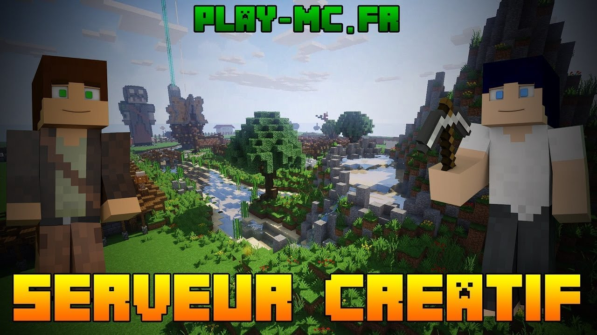

# Généralités

-----

::: tip IP de connexion :
crea.play-mc.fr
:::

Qu'entendons-nous par "vanilla créatif" ? Tout simplement la mise à disposition d'un terrain vierge avec le mode de jeu créatif \(gamemode 1\). Nous restons évidemment fidèles à notre marque de fabrique vanilla : un minimum de plugins et on reste proche du jeu de base !

 

Vos terrains et constructions sont protégés par le plugin "griefprevention" déjà utilisé sur le serveur survie. Pour rappel, la vidéo d'explication : 

 

Vous disposez dès votre 1ère connexion de **20.000 blocs** de claim ! Ceux-ci augmenteront de **1000 blocs par heure** de jeu. Vous êtes responsables de ce qu'il arrive dans votre claim et des personnes que vous autorisez à l'intérieur !

Dès votre arrivée, vous apparaîtrez au "spawn" ! Vous aurez alors le choix entre deux mondes distincts : "flatworld" et "seed"

* **Flatworld** est un monde plat, avec sous vos pieds 32 couches de matériaux \(1 bedrock, 20 pierre, 10 terre, 1 herbe\) ! Ce monde mesure 5.000 blocs de côté.

* **Seed** est constitué de la réplique du monde actuel de notre serveur survie \(sans les villages, temples etc.\) ! Ce monde mesure 10.000 blocs de côté.

### Commandes principales

* `/spawn` \(retour au spawn\)
* `/home` \(un point de sauvegarde de votre position\)

  Vous avez trois "home" à disposition, par exemple "/sethome a" puis "/sethome b" puis "/sethome c", que vous pourrez rejoindre avec "/home a" ou "/home b" ou encore "/home c". Il n'y a pas de limitation de temps entre deux /home. Petit détail... Les chiffres ne marchent pas 🙂

* `/tpa <pseudo>` \(demander à se téléporter vers pseudo\)
* `/tpahere <pseudo>` \(demander à pseudo de se téléporter vers vous\)
* `/tpyes` \(accepter le tp\)
* `/tpno` \(refuser le tp\)
* `/back` \(retourner en arrière\)
* `/give` \(se donner des items\)

### Ressources complémentaires

Découvrez le serveur créatif au travers d'une vidéo :

 

Un post sur notre forum est également à votre disposition pour acquérir un complément d'informations : [https://play-mc.fr/forum/d/637-un-nouveau-serveur-d-di-vanilla-cr-atif](https://play-mc.fr/forum/d/637-un-nouveau-serveur-d-di-vanilla-cr-atif)

